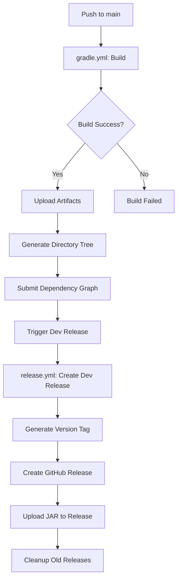

# 自动化工作流说明 | Automation Workflow Documentation

本项目配置了完整的GitHub Actions自动化流程，用于持续集成和自动发布。

## 工作流概览 | Workflow Overview

### 1. 构建工作流 (gradle.yml)
**触发条件 | Trigger Conditions:**
- 推送到main分支 | Push to main branch
- 对main分支的Pull Request | Pull Request to main branch

**功能 | Features:**
- ✅ 使用JDK 17编译Minecraft Mod
- ✅ 缓存Gradle依赖，加速构建
- ✅ 并行构建（最多12个worker）
- ✅ 上传构建产物（jar文件）
- ✅ 生成项目目录树和构建信息
- ✅ 提交依赖关系图到GitHub
- 🚀 **自动发布dev版本**（仅在push到main时）

### 2. 发布工作流 (release.yml)
**触发条件 | Trigger Conditions:**
- 每周一自动执行（发布weekly版本）| Weekly schedule (weekly release)
- 手动触发 | Manual trigger
- 通过gradle.yml自动触发（dev版本）| Auto-triggered by gradle.yml (dev release)

**发布类型 | Release Types:**
- **dev**: 开发版本，每次推送main分支自动发布
- **beta**: 测试版本，手动触发
- **release**: 正式版本，手动触发
- **weekly**: 每周版本，定时自动发布

**功能 | Features:**
- ✅ 自动生成版本号和标签
- ✅ 创建GitHub Release
- ✅ 上传jar文件到Release
- ✅ 生成详细的发布说明
- ✅ 自动清理旧版本（可配置）
- ✅ 支持预发布标记

## 自动发布流程 | Auto Release Process

## 版本命名规则 | Version Naming Rules

- **Release**: `v1.0.0`
- **Beta**: `v1.0.0-beta-20240115`
- **Dev**: `v1.0.0-dev-20240115-143025-abc1234`
- **Weekly**: `v1.0.0-weekly-20240115`

## 清理策略 | Cleanup Strategy

自动清理策略（激进模式）：
- **Dev版本**: 保留最新5个
- **Weekly版本**: 保留最新3个
- **Beta版本**: 保留最新10个
- **Release版本**: 不自动清理

## 手动触发发布 | Manual Release Trigger

1. 访问 [Actions页面](../../actions)
2. 选择 "自动发布 | Auto Release" 工作流
3. 点击 "Run workflow"
4. 选择发布类型和清理选项
5. 点击 "Run workflow" 确认

## 配置说明 | Configuration Notes

### 权限要求 | Required Permissions
- `contents: write` - 创建Release和标签
- `actions: write` - 触发其他工作流
- `security-events: write` - 提交依赖图

### 环境变量 | Environment Variables
- `GITHUB_TOKEN` - 自动提供，用于GitHub API访问

### 依赖配置 | Dependencies Configuration
- Java 17 (Temurin)
- Gradle (通过wrapper)
- GitHub CLI (预装在runner中)

## 故障排除 | Troubleshooting

### 构建失败 | Build Failures
1. 检查Java代码语法错误
2. 验证依赖版本兼容性
3. 查看详细构建日志

### 发布失败 | Release Failures
1. 确认Repository权限设置
2. 检查GITHUB_TOKEN权限
3. 验证版本号格式

### 清理过度 | Over-cleanup
如果意外清理了重要版本，可以：
1. 手动重新发布
2. 调整清理策略
3. 从备份恢复

## 监控和日志 | Monitoring and Logs

- 📊 构建状态：[Actions页面](../../actions)
- 📦 发布历史：[Releases页面](../../releases)
- 🔍 详细日志：点击具体的workflow run查看

---

**配置文件位置 | Configuration Files:**
- `.github/workflows/gradle.yml` - 构建工作流
- `.github/workflows/release.yml` - 发布工作流
- `gradle.properties` - 版本和依赖配置
- `build.gradle` - 构建配置
